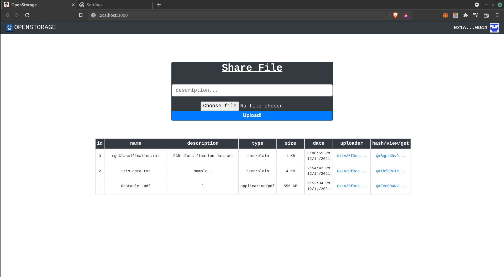

## ```OpenStorage : A Decentralized File Storage Facility. ```

[IPFS](https://ipfs.io/)   
  The InterPlanetary File System is a protocol and peer-to-peer network for storing and sharing data in a distributed file system. 

[Ganache](https://trufflesuite.com/ganache/)  
 A personal blockchain for Ethereum development you can use to deploy contracts, develop applications, and run tests.


## 🔧 Project Diagram:


Implementation Screenshot:



This project was implementation of an [youtube tutorial](https://youtu.be/1KwaUyjLa4Q) 
